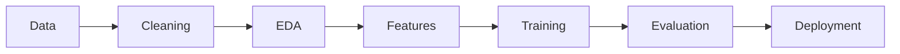

<!-- ======================= AI ENGINEER GITHUB README ======================= -->

  
  
  

## 🧠 About Me

I am an **Aspiring AI Engineer** focused on **Machine Learning, Deep Learning, and Data Science**.  
I enjoy transforming **raw data into intelligent systems** using algorithms, models, and visual insights.

---

## 🤖 AI / ML Workflow (Animated)

---

## 🛠️ Programming Languages

  

  

  

  
  

  

  

  
  

## 📊 Massive Visualization Dashboard

---

---

---

⭐ **Building intelligent systems with data, models & visualization** ⭐

<!-- ======================= END ======================= -->
