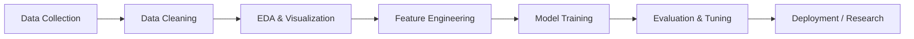

<!-- ======================= AI ENGINEER GITHUB README ======================= -->

  
  
  

---

## 🧠 About Me | AI Engineer Focus

I am an **Aspiring AI Engineer** with a strong foundation in **Machine Learning, Deep Learning, and Data Science**.  
My goal is to **design intelligent systems** that learn from data, make predictions, and solve real-world problems.

- 🔹 Strong interest in **ML research & applied AI**
- 🔹 Experience with **end-to-end ML pipelines**
- 🔹 Passionate about **model optimization & visualization**
- 🔹 Actively working on **research-oriented ML projects**

🎓 **B.Sc. in Computer Science & Engineering (CSE)**  
📍 **International University of Business Agriculture & Technology (IUBAT)**

---

## 🤖 AI / ML Workflow

---

## 🛠️ AI Tech Stack

### 🔹 Programming

  
  

### 🔹 Machine Learning & Deep Learning

  
  
  

### 🔹 Data Science & Visualization

  
  
  
  

### 🔹 Tools & Platforms

  
  
  

---

## 📊 GitHub Analytics

  
  

---

## 📈 Contribution & Activity

  

  

---

## 🤝 Connect With Me

  
  
  

---

⭐ **Building intelligent systems, one model at a time.**

<!-- ======================= END ======================= -->
